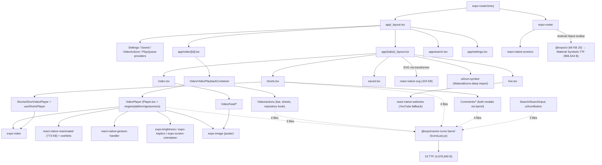
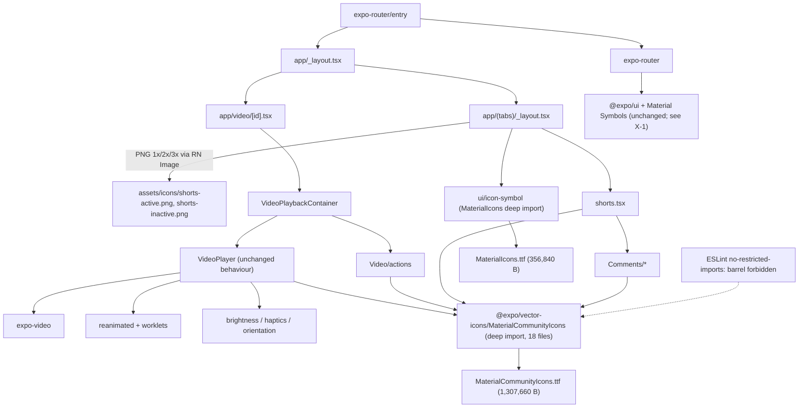
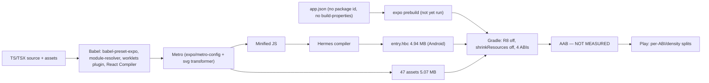
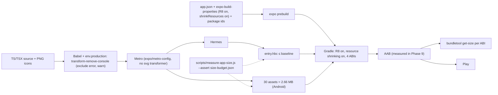
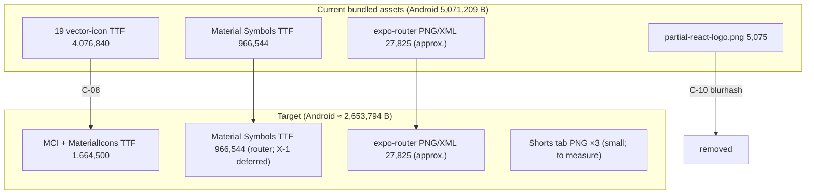
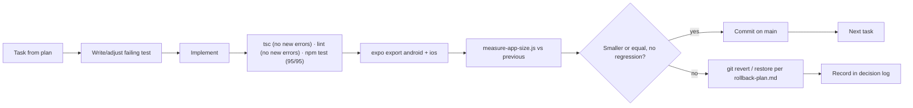

# Architecture Diagrams

All diagrams are Mermaid. "Current" reflects the repository on 2026-09-19; "Target" reflects the state after changes C-04 to C-14 with D-3 and D-4 approved.

## 1. Runtime module graph — current (what reaches the production bundle)

## 2. Runtime module graph — target

Removed from the graph: `react-native-svg`, `react-native-svg-transformer`, 17 TTFs, `partial-react-logo.png` (if D-5), `console.log/info/debug` calls (production only).

## 3. Native module inventory — current versus target (Android)

```mermaid
flowchart LR
  subgraph current["Current: 23 Expo + 11 RN modules"]
    direction TB
    c1["expo, modules-core, asset, constants, file-system, font, keep-awake, linking, splash-screen, status-bar, system-ui"]
    c2["expo-video, expo-image, expo-brightness, expo-haptics, expo-screen-orientation"]
    c3["expo-router, @expo/ui, @expo/dom-webview, @expo/log-box"]
    c4["expo-audio ✗, expo-linear-gradient ✗, expo-web-browser ✗"]
    c5["reanimated, worklets, gesture-handler, screens, safe-area-context, async-storage, webview, masked-view"]
    c6["slider ✗, svg ✗"]
  end
  subgraph target["Target: 20 Expo + 9 RN modules"]
    direction TB
    t1["unchanged runtime set"]
    t2["unchanged media set"]
    t3["unchanged router set"]
    t5["reanimated, worklets, gesture-handler, screens, safe-area-context, async-storage, webview, masked-view"]
  end
  current -->|"C-04, C-09"| target
```

✗ = removed by C-04 (expo-audio, expo-linear-gradient, expo-web-browser, slider) or C-09 (svg).

## 4. Build pipeline — current

## 5. Build pipeline — target

## 6. Asset flow — current versus target

## 7. Change control flow (per task)

