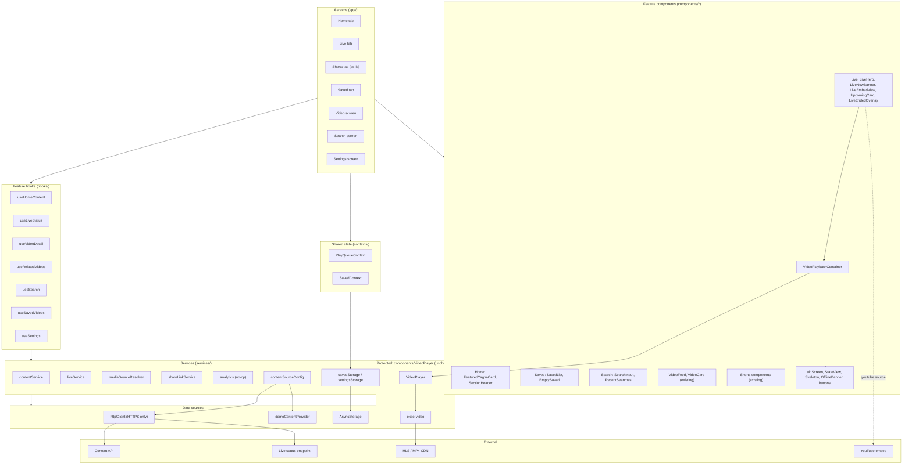
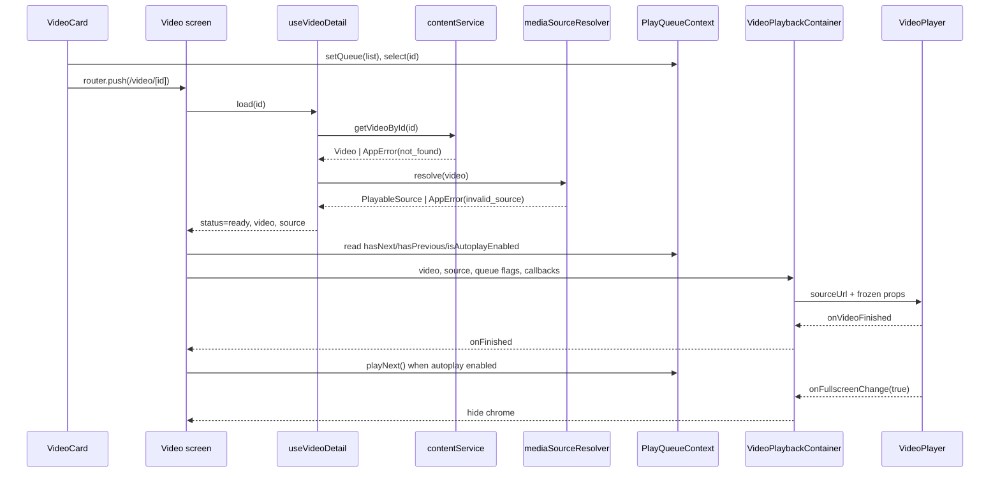
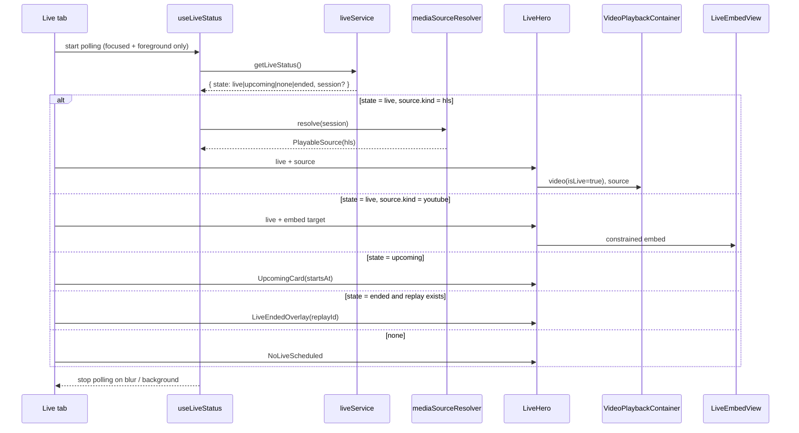
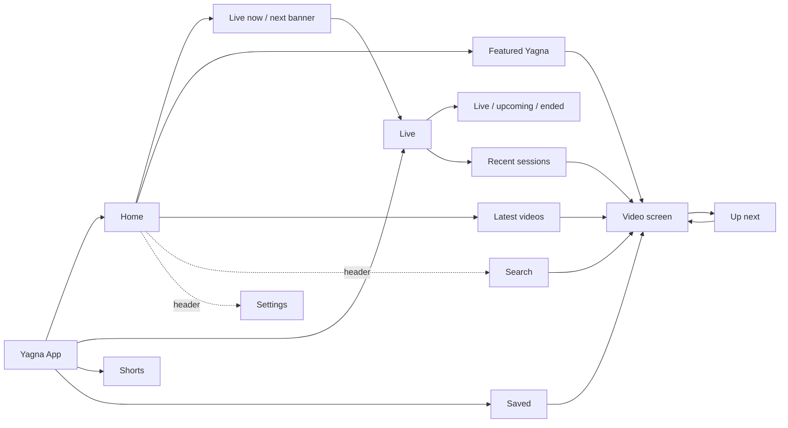
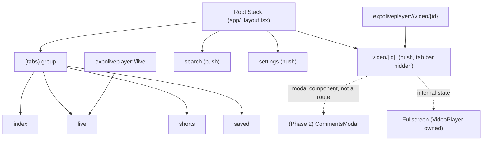
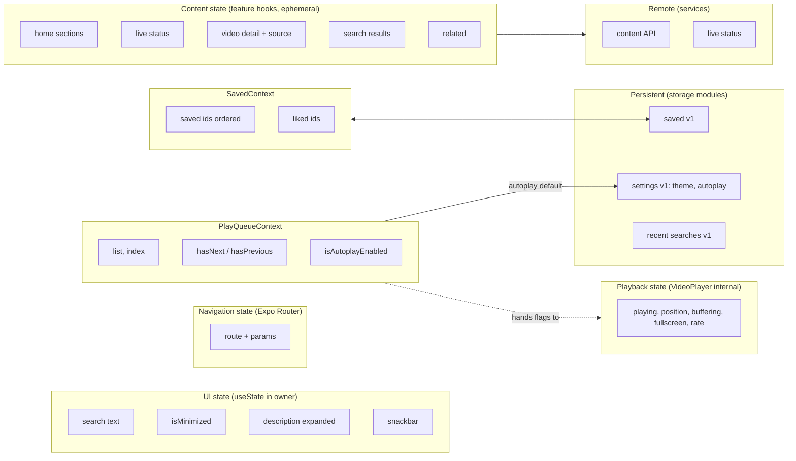
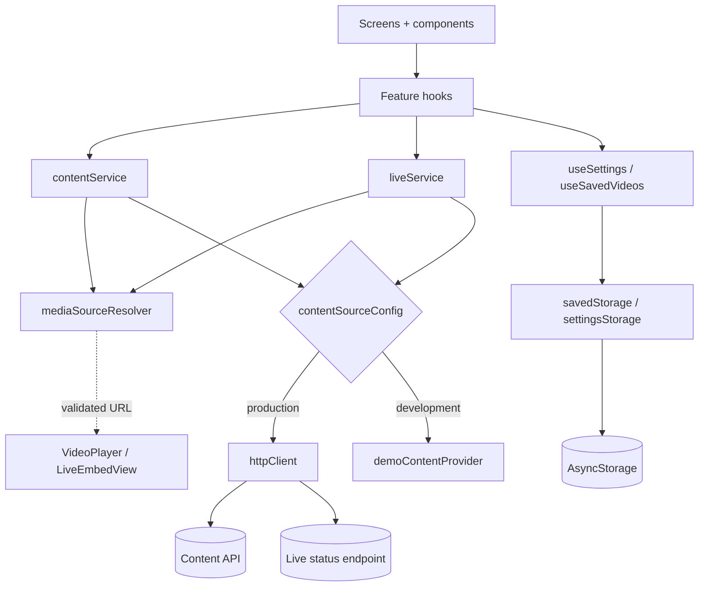
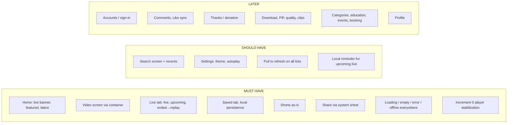

# Yagna Mobile App — High-Level Design (MVP)

| Field | Value |
|---|---|
| Status | Approved in brainstorming session, awaiting written review |
| Date | 2026-09-15 |
| Author | Fable (Principal Product / Mobile Architect role) |
| Reviewers | Human engineer (approval), Claude Opus (LLD) |
| Implementers | GLM 5.3 or Sonnet, from the approved LLD only |
| Branch | feature/mobile-hld |
| Scope | Mobile MVP for iOS and Android, Expo Managed Workflow, built around the existing VideoPlayer |

This document is the source of truth for the MVP architecture. Where it conflicts with the original brief (`docs/reference/prompt.md`), section L explains why the source code won. Where it conflicts with `CLAUDE.md`, flag it to the user rather than picking one.

---

## A. Executive Architecture Summary

The Yagna app MVP is a four-tab Expo Router application (Home, Live, Shorts, Saved) with three stack screens (Video, Search, Settings). It reuses the existing `components/VideoPlayer` unchanged behind a single feature component, the **VideoPlaybackContainer**, which is the only module that knows both the domain model and the player's real prop surface.

Five decisions define the design:

1. **The player is reused, not rewritten, and treated as working-but-flawed.** Known defects (type errors, a use-before-declaration bug, dead expo-av code, placeholder actions) are fixed in a separate, bounded *Increment 0: Player stabilization*. Application work does not depend on it.
2. **Two React contexts only.** `PlayQueueContext` (the narrowed existing VideoPlayerContext: list, index, next/previous, autoplay preference) and `SavedContext` (saved and liked id sets, persisted to device storage). No state library.
3. **Guest-only MVP.** No accounts, no auth surface, no secrets in the client. Saved, Liked, and Settings persist locally through versioned storage modules. Comments, Thanks, and server sync are Phase 2.
4. **Source-agnostic Live.** A `LiveSession` carries a source descriptor of kind `hls` or `youtube`. HLS plays through the existing player; YouTube plays through a constrained `LiveEmbedView` (react-native-webview, already installed). The player never knows about YouTube.
5. **Strict layering for AI-generated code.** Screens call hooks. Hooks call services. Services call data sources. Only storage modules touch AsyncStorage. Only the container imports the VideoPlayer. The repo must type-check before any feature increment merges.

The MVP is deliberately small: watch a video, join a live Yagna, browse Shorts, save for later, search, and set two preferences. Everything else is classified Should-Have or Later in section J.

---

## B. Mobile HLD

### B.1 Architecture overview



### B.2 Logical layers

| Layer | Responsibility | Allowed to import | Forbidden |
|---|---|---|---|
| Screens (`app/`) | Route params, layout, hook calls, navigation | Feature components, hooks, contexts, ui | Services, storage, VideoPlayer directly |
| Feature components (`components/<Feature>/`) | Render data and dispatch callbacks | ui, tokens, types | Services, storage, other features (except via ui) |
| Container (`components/Video/VideoPlaybackContainer`) | Map domain Video to VideoPlayer props; wire callbacks | VideoPlayer, contexts, shareLinkService, analytics | Playback internals, network |
| Protected player (`components/VideoPlayer/`, `components/Shorts/`) | Playback mechanics | expo-video, its own files | App services (existing imports are frozen until Increment 0 review) |
| Contexts (`contexts/`) | Shared state that genuinely crosses screens | Storage modules, types | Network, VideoPlayer |
| Hooks (`hooks/`) | Status machine, stale-response guard, cancellation | Services, types | Components, AsyncStorage |
| Services (`services/`) | Typed domain functions, validation, error mapping | Data sources, types | React, components |
| Data sources | HTTP client, storage modules, demo provider | fetch, AsyncStorage | Domain logic |

### B.3 Component boundaries

- **VideoPlayer boundary (frozen).** The real prop surface of `components/VideoPlayer/index.tsx` as of this document: `sourceUrl`, `autoplay`, `buttonSize`, `hasPreviousVideo`, `hasNextVideo`, `onNavigateToPrevious`, `onNavigateToNext`, `isMinimized`, `onToggleMinimize`, `onFullscreenChange`, `isAutoplayEnabled`, `onVideoFinished`, `captions`, `chapters`, `hideControlsTimeout`, `theme`, plus `videoId`, `videoTitle`, `videoUrl`, `channelId` (destructured but missing from the Props type; Increment 0 aligns the type). No new props are added by app increments.
- **Container boundary.** One component, one job: domain in, player props out, two events up (finished, fullscreen changed).
- **Live boundary.** `components/Live` owns live UI. It renders the container for HLS and `LiveEmbedView` for YouTube. Live status is data, not player state.
- **Shorts boundary.** `components/Shorts` and `hooks/useShortsPlayer` are reused as-is. No app increment modifies them.

### B.4 Navigation

Single root stack containing the tab group. See section D.

### B.5 Data flow

```
User intent (tap, pull, type)
  → Screen handler
  → Feature hook (sets status=loading, issues request id)
  → Service (validates input, calls data source, maps errors to AppError)
  → Data source (HTTP or storage or demo)
  → Hook (discards stale response, sets status=success|empty|error|offline)
  → Screen renders StateView or content
```

### B.6 Video flow



### B.7 Live flow



### B.8 State ownership

See section G and the state-ownership diagram there.

### B.9 External integrations

| Integration | MVP use | Mechanism | Trust boundary |
|---|---|---|---|
| Content API | Featured, latest, by id, related, search | `httpClient` over HTTPS | Responses validated with schema guards before use |
| Live status endpoint | Live state, session, source descriptor, recent sessions | `httpClient`, polled | Source URL validated by resolver; allowlisted hosts in production |
| HLS / MP4 CDN | Playback | expo-video via VideoPlayer | HTTPS only, extension or explicit kind check |
| YouTube embed | Live fallback only | react-native-webview | Fixed embed origin allowlist, no arbitrary URLs, navigation locked |
| Device storage | Saved, liked, settings, recent searches | AsyncStorage via storage modules | Versioned JSON, schema guard on read, corrupt data reset with log |
| System share sheet | Share action | React Native Share | Deep link built by shareLinkService only |
| Analytics | Three events, no-op sink | `services/analytics` | No personal data collected in MVP |

No integration in the MVP requires a client secret. Adding one requires an ADR and secure storage design.

---

## C. Information Architecture



| Area | MVP | Phase 2 | Future |
|---|---|---|---|
| Home | Live banner, Featured, Latest | Categories, Educational, Events sections | Personalised home |
| Videos | Video screen, Up next, Share, Save, Like (local) | Comments (read + post with accounts), Like sync, resume position | Download, PiP, quality, clips, Thanks |
| Live | Live tab, badge, upcoming, ended-to-replay, recent sessions | Reminder notifications, chat | Multi-camera, schedule calendar |
| Shorts | As-is | Shorts search polish, Save from Shorts | Shared playback abstraction |
| Search | Text search, recent queries | Filters, suggestions | Voice search |
| Saved | Local persistence, unsave with undo | Server sync with accounts, playlists | Offline downloads |
| Profile | Not in MVP | Sign-in, profile | Community, participation |
| Settings | Theme, autoplay default | Notifications, data saver | Language |

---

## D. Navigation Architecture



Rules:

- **Stack over tabs.** Video, Search, and Settings push over the tab group so the tab bar is hidden and the video screen owns the viewport. Back returns to the originating tab with its scroll position retained by the list itself (no context mirror).
- **Fullscreen is not a route.** The player handles orientation and fullscreen internally and reports via `onFullscreenChange`. The screen hides its header and chrome and locks nothing itself.
- **No modal routes in MVP.** The existing `app/modal.tsx` template route is removed. Comments remain a component-level modal for Phase 2.
- **Deep links.** Two paths, both validated by the same guards as route params. Invalid or unknown links land on Home silently (logged, no dialog).
- **Route params.** `video/[id]` accepts `id` only in production builds. The `url` and `title` params are development-only and rejected by the resolver when `contentSourceConfig.mode === 'production'`.
- **Explore tab and template files** (`explore.tsx`, `parallax-scroll-view`, `hello-wave`, `collapsible`, `external-link`) are removed in Increment 2 after confirming no imports remain.

---

## E. Screen Inventory

Every screen renders all of: `loading`, `success`, `empty`, `error` (with retry), `offline` (with retry), using the shared `StateView`. Lists use stable keys (`video.id`) and virtualization (`FlatList` or `FlashList` is not added; use the existing `FlatList`).

### E.1 Home — `app/(tabs)/index.tsx`

| Field | Detail |
|---|---|
| Purpose | Discover current Yagna content quickly |
| User goal | Find something to watch now or join the live Yagna |
| Entry points | App launch, tab press, back from Video/Search/Settings, invalid deep link fallback |
| Exit points | Video screen, Live tab, Search, Settings |
| Major UI sections | Header (branding "Yagna Vishnu Bhagwan", subtitle "Divya Darshan", search icon, settings icon); LiveNowBanner; FeaturedYagnaCard; LatestVideosFeed (existing VideoFeed) |
| Data required | `useHomeContent` (featured: Video, latest: Video[] paginated); `useLiveStatus` (LiveStatus) |
| Actions | Open video (sets PlayQueue from latest list, pushes video); open live; open search; open settings; pull to refresh; load more |
| States | Per-section loading skeletons; partial success (a failed section shows inline retry, others render); empty latest; error; offline banner with cached-nothing message |
| Navigation | `router.push('/video/[id]')`, `router.navigate('/(tabs)/live')`, `router.push('/search')`, `router.push('/settings')` |
| Dependencies | PlayQueueContext (write), contentService, liveService, tokens, StateView |

### E.2 Video — `app/video/[id].tsx`

| Field | Detail |
|---|---|
| Purpose | Watch one video and act on it |
| User goal | Play, continue to next, save, share |
| Entry points | Any VideoCard, Up next, autoplay-next, Saved list, Search result, Recent live session, deep link |
| Exit points | Back (to originating tab), next/previous (same route, replaced params), minimize (stays on screen, minimized UI) |
| Major UI sections | VideoPlaybackContainer; VideoMeta (title, channel, date, views, expandable description); player-owned action bar; UpNextList (existing) |
| Data required | `useVideoDetail(id)` → Video + PlayableSource; `useRelatedVideos(id)`; PlayQueueContext (hasNext, hasPrevious, isAutoplayEnabled, playNext, playPrevious); SavedContext (isSaved, isLiked) |
| Actions | Play controls (player-owned); next/previous; toggle autoplay; save/unsave; like/unlike (local); share; minimize/restore; open related |
| States | `resolving` (skeleton with 16:9 placeholder); `not_found`; `invalid_source` / `unsupported_source`; `offline`; `ready`; player-internal error and buffering (rendered by the player) |
| Navigation | `router.setParams({ id })` for next/previous so the stack does not grow; back pops |
| Dependencies | VideoPlaybackContainer, contentService, mediaSourceResolver, shareLinkService, analytics (video_start, video_finish), PlayQueueContext, SavedContext |
| Notes | Fullscreen hides header via `onFullscreenChange`. When the queue is empty (deep link), hasNext/hasPrevious are false and Up next comes from related videos. Header uses only options supported by Expo Router v6 (the current `headerBackTitleVisible` usage is invalid and is fixed in Increment 3). |

### E.3 Live — `app/(tabs)/live.tsx`

| Field | Detail |
|---|---|
| Purpose | Join the live Yagna or see the next one |
| User goal | Watch live with minimal friction; know when the next Yagna is |
| Entry points | Tab press, LiveNowBanner, deep link `live` |
| Exit points | Video screen (replay or recent session), other tabs |
| Major UI sections | LiveHero (one of: container with LiveBadge overlay; LiveEmbedView; UpcomingCard with local-time start and countdown; LiveEndedOverlay with replay button; NoLiveScheduled); RecentSessionsList |
| Data required | `useLiveStatus` (state, session, source descriptor, replayVideoId, startsAt); `liveService.getRecentSessions()` |
| Actions | Play live (autoplay on when live); open replay; open recent session; retry; pull to refresh |
| States | `live_hls`, `live_youtube`, `upcoming`, `ended_with_replay`, `ended_no_replay`, `none`, `loading`, `error`, `offline` |
| Navigation | Replays and recent sessions push `/video/[id]` with isLive false |
| Dependencies | VideoPlaybackContainer, LiveEmbedView, liveService, mediaSourceResolver, analytics (live_join) |
| Polling | Interval constant (default 30 s), only while tab is focused and app is foregrounded; exponential backoff to a max on error; single in-flight request |
| Failure handling | Stream 404 or manifest error mid-play: the player shows its error; the hero re-checks status once and, if ended, shows LiveEndedOverlay. Network loss: OfflineBanner, playback error handled by player, status polling paused until online |

### E.4 Shorts — `app/(tabs)/shorts.tsx`

| Field | Detail |
|---|---|
| Purpose | Vertical short-form Yagna clips |
| Status | Reused as-is. No app increment modifies `app/(tabs)/shorts.tsx`, `components/Shorts/`, `hooks/useShortsFeed.ts`, `hooks/useShortsPlayer.ts`, or `services/shortsSearchService.ts` |
| Dependencies | Existing only. Data continues to come through the content-source config (demo in development). |
| Known limitations | Separate player; no Save integration; search UX as delivered. Recorded in section M for later. |

### E.5 Saved — `app/(tabs)/saved.tsx`

| Field | Detail |
|---|---|
| Purpose | Return to saved videos |
| User goal | Find what I saved, quickly |
| Entry points | Tab press |
| Exit points | Video screen |
| Major UI sections | Header; SavedList (VideoCard rows, most recent first); EmptySaved |
| Data required | SavedContext (ordered saved ids); `useSavedVideos` hydrates ids to Video[] via `contentService.getVideosByIds(ids)` in bounded batches (constant, e.g. 20) |
| Actions | Open video (PlayQueue set to saved list); unsave with 5-second undo snackbar; pull to refresh |
| States | `loading`, `empty` (hint: "Tap Save on any video"), `success`, `partial` (ids missing from catalog are shown as "No longer available" and pruned on confirmation), `error`, `offline` (ids known, metadata unavailable: show titles from a small cached title map if present, else offline state) |
| Navigation | `router.push('/video/[id]')` |
| Dependencies | SavedContext, contentService, PlayQueueContext |

### E.6 Search — `app/search.tsx`

| Field | Detail |
|---|---|
| Purpose | Find a specific video |
| User goal | Type a few words, get relevant videos |
| Entry points | Home header search icon |
| Exit points | Video screen, back |
| Major UI sections | SearchInput (autofocus, clear, debounce constant 400 ms); RecentSearches (max 10, from settingsStorage); results list (VideoCard) |
| Data required | `useSearch(query)` over `contentService.search(query, page)`; recent searches from storage |
| Actions | Type, submit, tap recent, clear recents, open result, load more |
| States | `idle` (recents or hint), `searching`, `results`, `empty` ("No videos for …"), `error`, `offline` |
| Validation | Trim, strip control characters, max 100 characters, minimum 2 characters to query |
| Navigation | `router.push('/video/[id]')` with PlayQueue set to results |
| Dependencies | contentService, settingsStorage, PlayQueueContext |

### E.7 Settings — `app/settings.tsx`

| Field | Detail |
|---|---|
| Purpose | Two preferences |
| User goal | Choose theme; choose whether videos autoplay next |
| Entry points | Home header settings icon |
| Exit points | Back |
| Major UI sections | Appearance (System / Light / Dark); Playback (Autoplay next toggle); About (app version, licences link) |
| Data required | `useSettings` over settingsStorage |
| Actions | Set theme; set autoplay default (also updates PlayQueueContext); clear recent searches |
| States | `loading` (brief), `ready`, `storage_error` (show defaults, log, allow retry) |
| Dependencies | settingsStorage, PlayQueueContext |
| Note | The existing `app/(tabs)/settings.tsx` is moved to `app/settings.tsx` and wired to persisted values. |

---

## F. Component Architecture

### F.1 Screen components

Files under `app/`. Layout and hook calls only. Target under 150 lines each. No service, storage, or VideoPlayer imports.

### F.2 Feature components

| Folder | Components | Notes |
|---|---|---|
| `components/Video/` | `VideoPlaybackContainer`, `VideoMeta` | Container is the only non-test importer of `components/VideoPlayer` |
| `components/Live/` | `LiveHero`, `LiveNowBanner`, `LiveEmbedView`, `UpcomingCard`, `LiveEndedOverlay`, `LiveBadge`, `RecentSessionsList` | LiveBadge is an overlay; the player's own `isLive` control flag is not used in MVP |
| `components/Home/` | `FeaturedYagnaCard`, `SectionHeader` | |
| `components/Saved/` | `SavedList`, `EmptySaved` | |
| `components/Search/` | `SearchInput`, `RecentSearches` | |
| `components/VideoFeed/` | existing `VideoFeed`, `VideoCard`, `VideoCardSkeleton`, `UpNextList` | Reused; `app/video/VideoCard.tsx` duplicate is removed in Increment 3 |
| `components/Shorts/` | existing | Untouched |
| `components/Comments/` | existing | Not wired in MVP |

### F.3 Shared components (`components/ui/`)

| Component | Purpose |
|---|---|
| `Screen` | Safe-area aware wrapper with background from tokens |
| `StateView` | One component rendering loading, empty, error, offline from a `status` prop, with optional `onRetry` |
| `Skeleton` | Shimmer placeholders (card, hero, text line) |
| `OfflineBanner` | Persistent banner driven by connectivity state |
| `PrimaryButton`, `IconButton` | Token-driven buttons |
| existing `themed-text`, `themed-view`, `icon-symbol` | Kept |

Connectivity: a small `useIsOnline` hook derives an offline signal from `AppError.code === 'network'` results and `AppState` foreground transitions (re-check on resume). No new dependency; if the LLD proves `@react-native-community/netinfo` is required, that needs an ADR.

### F.4 VideoPlaybackContainer contract

```
Props (domain side):
  video: Video                       // id, title, channel, isLive, captions?, chapters?
  source: PlayableSource             // { url, kind: 'hls' | 'mp4' }
  queue: { hasNext, hasPrevious, isAutoplayEnabled }
  onNext(), onPrevious()
  onFinished()
  onFullscreenChange(isFullscreen)
  isMinimized, onToggleMinimize()
Renders:
  <VideoPlayer sourceUrl={source.url} autoplay hasPreviousVideo hasNextVideo
    onNavigateToPrevious onNavigateToNext isAutoplayEnabled onVideoFinished
    onFullscreenChange isMinimized onToggleMinimize captions chapters
    videoId videoTitle videoUrl channelId theme />
Owns:
  analytics video_start on mount / source change, video_finish on finished
Does not:
  read playback position, buffering, or errors; call network; know about YouTube
```

### F.5 Action ownership

| Action | UI location | Owner | MVP behaviour |
|---|---|---|---|
| Play, pause, seek, mute, speed, captions, chapters, loop, fullscreen | Player | Player | As-is |
| Next / previous | Player buttons | PlayQueueContext via container | As-is |
| Autoplay toggle | Player | PlayQueueContext, persisted via settingsStorage | Wired in Increment 3 |
| Save | Player save sheet | SavedContext | Sheet's playlist UI is replaced by a single "Saved" toggle in Increment 4 (playlists are Later); persists locally. This is a bounded change to `components/VideoPlayer/modals/VideoSaveSheet.tsx` under the protected-module workflow in `docs/engineering/video-player.md` and is the only player-folder edit outside Increment 0 |
| Like | Player action bar | SavedContext liked set | Local optimistic flag, no counts shown |
| Share | Player share sheet | shareLinkService + system share | Deep link only; in-app share targets removed |
| Thanks, Download, Clip, Quality, PiP | Player | None in MVP | Hidden behind `PLAYER_FEATURE_FLAGS` constants set to false in Increment 0; each stays off until verified end to end |
| Report | Player more menu | None in MVP | Hidden |

### F.6 Data/service boundaries

See section H.

---

## G. State Architecture



| Kind | Owner | Mechanism | Rule |
|---|---|---|---|
| UI | Screen or component | `useState` | Never lifted unless two screens need it |
| Navigation | Expo Router | Router | No mirror in context (home scroll position leaves the context) |
| Content | Feature hooks | Hook-local `{ status, data, error, retry }` | No cross-screen cache in MVP; stale-response guard by request id; cancel on unmount |
| Player navigation | `PlayQueueContext` | React context (renamed from VideoPlayerContext, same next/previous/autoplay API) | Drops `homeScrollPosition`; `setQueue(list, startId)` replaces `setVideoList` + `playVideoById` pair |
| Playback | VideoPlayer | Internal | Never lifted |
| User | none | n/a | Reserved |
| Persistent | `savedStorage`, `settingsStorage` | AsyncStorage, versioned JSON, schema guard | Only these modules import AsyncStorage |
| Remote | Services | fetch | Never called from components |

**Hook status union** (shared type): `'idle' | 'loading' | 'success' | 'empty' | 'error' | 'offline'`. Every hook exposes `status`, `data`, `error?: AppError`, `retry()`, and for lists `loadMore()` and `hasMore`.

**SavedContext contract:** `savedIds: string[]` (most recent first), `likedIds: Set<string>`, `isSaved(id)`, `toggleSave(id)`, `isLiked(id)`, `toggleLike(id)`, `hydrated: boolean`. Writes are debounced (constant) and serialized to avoid interleaved storage writes. Hydration failure logs and starts empty; a corrupt payload is reset to the empty schema with a log.

**Why not a state library:** the only cross-screen state is a queue and two id sets. Both fit React context without re-render problems at MVP scale. Revisit only if profiling shows context re-render cost or a third shared domain appears (ADR 2).

---

## H. Data/API Boundary



### H.1 Domain types (`types/`)

- `Video`: `id`, `title`, `description?`, `thumbnailUrl`, `durationSec`, `publishedAt`, `channel: { id, name, avatarUrl? }`, `isLive: boolean`, `source: SourceDescriptor`, `captions?`, `chapters?`, `tags?`. Evolves from the existing `VideoMetadata` (rename is an LLD decision; keep one type, no duplicates).
- `SourceDescriptor`: `{ kind: 'hls' | 'mp4' | 'youtube', url: string }`.
- `PlayableSource`: `{ kind: 'hls' | 'mp4', url: string }` (resolver output; never `youtube`).
- `LiveStatus`: `{ state: 'live' | 'upcoming' | 'ended' | 'none', session?: LiveSession, checkedAt }`.
- `LiveSession`: `{ id, title, startsAt, endedAt?, source: SourceDescriptor, replayVideoId?, thumbnailUrl }`.
- `AppError`: `{ code: 'network' | 'timeout' | 'not_found' | 'invalid_source' | 'unsupported_source' | 'storage' | 'validation' | 'unknown', message: string /* safe for users */, cause?: unknown /* logged, never shown */ }`.

### H.2 Services

| Service | Functions | Notes |
|---|---|---|
| `contentService` | `getFeatured()`, `getLatest(page)`, `getVideoById(id)`, `getVideosByIds(ids)`, `getRelated(id)`, `search(query, page)` | Existing `videoService` functions are migrated here under the same names where they exist; `videoService.ts` is removed when no importer remains |
| `liveService` | `getLiveStatus()`, `getRecentSessions()` | Single in-flight guard for status |
| `mediaSourceResolver` | `resolve(input: Video \| LiveSession): PlayableSource \| AppError`, `resolveEmbed(session): EmbedTarget \| AppError` | HTTPS only; production host allowlist from config; `.m3u8`/`.mp4` or explicit kind; rejects `youtube` for the player path |
| `shareLinkService` | `forVideo(id)`, `forLive()` | Uses the `expoliveplayer` scheme plus a configurable https web fallback base |
| `analytics` | `track(event, props)` | No-op sink in MVP; events: `video_start`, `video_finish`, `live_join` |
| `savedStorage` | `read(): SavedState`, `write(state)` | Key `yagna.saved.v1` |
| `settingsStorage` | `read(): Settings`, `write(settings)`, `readRecentSearches()`, `writeRecentSearches()` | Keys `yagna.settings.v1`, `yagna.recentSearches.v1` |
| `httpClient` | `get<T>(path, schemaGuard, { timeoutMs, signal })` | HTTPS base URL from config; timeout constant; maps fetch failures to `network`/`timeout`; validates with schema guard; no retries beyond one for idempotent GET on network error |
| `demoContentProvider` | Same shape as the API responses | Holds today's `SAFE_VIDEO_CATALOG` and `MOCK_VIDEOS`; includes one HLS live sample and one upcoming sample |
| `contentSourceConfig` | `{ mode: 'production' \| 'development', apiBaseUrl, allowedMediaHosts, liveSourceFallback: 'youtube' \| 'none' }` | Read from `expo-constants` extra; no secrets |

### H.3 Rules

- Services are pure async functions; no React imports.
- All untrusted input (route params, deep links, API responses, storage payloads) passes a guard before use.
- Errors shown to users come only from `AppError.message`.
- No analytics or logging of URLs with query strings, or of any personal data.

---

## I. Design System

Single token module `constants/tokens.ts`, extending the existing `constants/theme.ts` (which stays for compatibility until every importer moves).

| Group | Tokens |
|---|---|
| Colors (semantic, light + dark) | `primary` (saffron family), `onPrimary`, `background`, `surface`, `surfaceElevated`, `text`, `textMuted`, `border`, `overlay`, `live` (single red), `success`, `danger`, `skeleton` |
| Typography | `title` (24/600), `heading` (18/600), `body` (15/400), `caption` (12/400); families: existing Mukta or Noto Sans Devanagari for Hindi text, Roboto/system for Latin |
| Spacing | `xs 4`, `sm 8`, `md 12`, `lg 16`, `xl 24`, `xxl 32` |
| Radius | `sm 6`, `md 10`, `lg 16`, `pill 999` |
| Elevation | `level1`, `level2` (shadow + Android elevation) |
| Icons | `@expo/vector-icons` only; sizes `sm 18`, `md 24`, `lg 28` |
| Motion | `fast 150`, `normal 250` |

Components governed by tokens: buttons, cards, video cards, live badge, banners, skeletons, StateView (loading, empty, error, offline), bottom tab bar (active tint = `primary`, inactive = `textMuted`).

Accessibility: minimum touch target 44 pt; every interactive element has `accessibilityRole` and `accessibilityLabel`; text contrast meets 4.5:1 in both schemes; dynamic type respected for body and caption.

The player's `components/VideoPlayer/tokens.ts` stays separate in MVP. Merging is a later item (section M).

---

## J. MVP Scope



Should-Have items ship in the MVP if Increments 6 and 7 complete within the release window; otherwise they roll to the first update. Later items require their own HLD sections.

---

## K. Architecture Decision Records

### ADR 1 — Reuse VideoPlayer behind one container
- **Decision:** Screens never import VideoPlayer. `VideoPlaybackContainer` maps domain to the frozen prop surface.
- **Reason:** Preserves working playback, isolates the app from player churn, gives a single place to change when the player is later fixed.
- **Alternatives:** Rewrite the player; build a second player; let screens use the player directly.
- **Why rejected:** Rewrite violates the brief and risks regressions; a second player duplicates logic; direct use spreads the prop contract across screens.
- **Consequences:** One extra component. The container must be kept thin; it is reviewed for scope creep in every LLD.

### ADR 2 — Two contexts, no state library
- **Decision:** `PlayQueueContext` and `SavedContext` only.
- **Reason:** Only queue and saved sets cross screens. Content is ephemeral per screen in MVP.
- **Alternatives:** Zustand or Redux; one app-wide context; no context (prop drilling).
- **Why rejected:** Libraries add a dependency for two small stores; a single app context re-renders everything; prop drilling through the router is impossible.
- **Consequences:** A third shared domain requires an ADR. Re-render cost is measured before any optimisation.

### ADR 3 — Local-only persistence with versioned schema
- **Decision:** AsyncStorage through `savedStorage` and `settingsStorage`, keys suffixed `.v1`, schema-guarded reads.
- **Reason:** Guest-only MVP; enables a later server merge without changing screens.
- **Alternatives:** Server-backed saved; no persistence; SQLite.
- **Why rejected:** Server needs accounts; no persistence makes Saved useless; SQLite adds a dependency for two small documents.
- **Consequences:** Phase 2 must define a merge rule (local ∪ server, server wins on conflict) when accounts arrive.

### ADR 4 — Source-agnostic Live: HLS primary, YouTube embed fallback
- **Decision:** `LiveSession.source.kind` selects the path. HLS uses the existing player. YouTube uses a constrained WebView component.
- **Reason:** Stream provider is undecided. The player cannot play YouTube.
- **Alternatives:** HLS only; YouTube only.
- **Why rejected:** HLS only blocks MVP if the provider ends up YouTube; YouTube only gives a weaker experience and bypasses the player.
- **Consequences:** Two live surfaces to test. `LiveEmbedView` has a locked origin allowlist and no navigation. Removing the fallback later is deleting one component.

### ADR 5 — Unified video detail and player screen
- **Decision:** One route renders player, metadata, and Up next.
- **Reason:** Existing screen already works this way; a separate detail route adds a hop with no user benefit.
- **Alternatives:** Detail screen with a play button; player-only full-screen route.
- **Why rejected:** Extra navigation; fullscreen is already player-owned.
- **Consequences:** Screen must stay under the size limit by delegating to `VideoMeta` and `UpNextList`.

### ADR 6 — Four tabs; Search and Settings as stack screens
- **Decision:** Home, Live, Shorts, Saved.
- **Reason:** Each tab is a distinct daily destination. Search and Settings are tasks, not destinations.
- **Alternatives:** Five tabs with Search; drawer; Explore tab retained.
- **Why rejected:** Five tabs crowd small screens; drawer is already a dependency but a worse fit for media apps; Explore is a template placeholder.
- **Consequences:** `@react-navigation/drawer` becomes unused and is removed in Increment 2 after an import check.

### ADR 7 — Comments and accounts deferred
- **Decision:** Not in MVP. Existing components remain unwired.
- **Reason:** Posting needs identity; read-only mock comments add UI without value.
- **Alternatives:** Read-only comments in MVP; optional sign-in.
- **Why rejected:** Mock data in production is misleading; optional sign-in adds auth, secure storage, and merge logic to the smallest release.
- **Consequences:** Phase 2 HLD section required for auth and comments.

### ADR 8 — Shorts reused as-is
- **Decision:** No changes to Shorts in MVP.
- **Reason:** It works and is separate by rule.
- **Alternatives:** Merge with VideoPlayer; remove Shorts.
- **Why rejected:** Merge is a player redesign; removal drops a working feature.
- **Consequences:** Shorts lacks Save integration until a later increment.

### ADR 9 — Player stabilization as Increment 0, player recorded as working-but-flawed
- **Decision:** A bounded, no-behavior-change increment runs before feature work: align `Props` with the real component; fix the `isPlaying` use-before-declaration; delete `hooks/useVideoPlayer.ts` (expo-av, uninstalled); move demo and example files out of the component folder; fix icon prop typing in `Controls.tsx`; replace the private Animated call in `AutoplayNotification.tsx`; add `PLAYER_FEATURE_FLAGS` hiding Thanks, Download, Clip, Quality, PiP, Report. Exit: zero TypeScript errors in `components/VideoPlayer` and `app/video`, HLS and MP4 play on both platforms, fullscreen and orientation unchanged, existing tests pass.
- **Reason:** 68 TypeScript errors exist today, including a latent runtime defect. The player must pass the project's strict gate before it is the authoritative implementation. The user has stated the player has broader design, functional, and performance issues to be fixed later; those are out of Increment 0 scope.
- **Alternatives:** Fix the player before the HLD; fold fixes into feature tasks.
- **Why rejected:** Before the boundary is decided a fixer cannot tell contract from cleanup, so hygiene becomes redesign; folding into feature tasks hides player changes in unrelated diffs.
- **Consequences:** Increment 0 is a prerequisite for Increment 3. Deeper player work gets its own future HLD/LLD (section M).

### ADR 10 — Build-time demo/production content switch
- **Decision:** `contentSourceConfig.mode` selects `demoContentProvider` or `httpClient`. Nothing else knows which is active.
- **Reason:** Keeps demo content out of screens and out of production builds.
- **Alternatives:** Runtime toggle in Settings; keep the catalog in the video screen.
- **Why rejected:** Runtime toggle is an attack surface and a support burden; in-screen catalog is the current architecture issue C.
- **Consequences:** Demo provider must mirror API response shapes so schema guards apply to both.

---

## L. Challenges to Existing Documentation and Assumptions

| Claim in brief or docs | Finding in source | Resolution |
|---|---|---|
| Player uses expo-av | `components/VideoPlayer/index.tsx` imports expo-video; expo-av is not installed; only `hooks/useVideoPlayer.ts` references it and nothing imports that file | HLD targets expo-video. Dead file removed in Increment 0 |
| Player inputs are sourceUrl, autoplay, captions, chapters, theme, onFullscreenChange | Real component also takes queue, minimize, autoplay-next, and metadata props; four of them are missing from the Props type | Frozen contract is the real surface; type aligned in Increment 0 |
| Node.js 18.20.8 | CLAUDE.md states 26.8.2 | Follow CLAUDE.md; brief is stale |
| Player handles live | No `isLive` is ever set by the main component; only the Controls type mentions it | Live badge and states are app-level overlays in `components/Live` |
| Like and Save require verification of persistence | No AsyncStorage use anywhere; `videoActionsService` is in-memory | Save/Like ownership moves to SavedContext with storage |
| Tabs are Home, Shorts, Explore | Explore is the template placeholder; a Settings screen file exists but is unregistered | Explore removed; Settings becomes a stack screen |
| SRS/SDS/SolAD/LLD exist | Not in the repo; ~45 root-level delivery notes exist | Treated as history. Recommend moving them to `docs/history/` in Increment 1 (no content changes) |
| Video screen falls back to the first catalog entry for an unknown id | `app/video/[id].tsx` does `?? SAFE_VIDEO_CATALOG[0]` | Unknown id becomes a `not_found` state; fallback removed |
| `@react-navigation/drawer` is needed | Not used by any route | Removed after import check (ADR 6) |
| Voice search is a feature | `hooks/useVoiceSearch.ts` exists with no native speech dependency in package.json | Out of MVP; hook left untouched, listed in section M |

Overengineering observed: playlist-based Save sheet without persistence; clip editor and download modal without backing services; multiple README and demo files inside the player folder. Missing requirements identified: live state model, offline behaviour, deep-link validation, storage schema versioning, error model. All are addressed above.

---

## M. Future Player Refactoring Items (documented, not scheduled)

These are outside every MVP increment. Each needs its own approved scope.

1. Align `components/VideoPlayer/types.ts` fully with the component and remove `any` from `ControlsProps.handlers` and `tokens`.
2. Expose a minimal playback-state callback (position, ended, error code) for resume-position and analytics; today nothing is exposed and the app needs nothing.
3. Merge `components/VideoPlayer/tokens.ts` into `constants/tokens.ts`.
4. Evaluate a shared media-source hook between VideoPlayer and ShortVideoPlayer once both are stable.
5. Verify or remove Download, PiP, quality selection, clip editor, Thanks, and Report end to end; each currently has UI only.
6. Performance review of the player (re-render count per status update, controls animation cost, memory on source change) with measured baselines before changes.
7. Address the broader design and functional issues the user has flagged in the player, as a separate HLD/LLD.
8. Voice search (`hooks/useVoiceSearch.ts`) needs a dependency decision before it can be a feature.

---

## N. AI-Code Quality Rules (binding for LLD and implementation)

1. **Search before creating.** A new component, hook, service, type, or constant must cite the search that found no equivalent.
2. **One responsibility per file.** Screens under ~150 lines, components under ~200. Split before exceeding.
3. **Layer imports are enforced by review:** screens → hooks/contexts/components; components → ui/tokens/types; hooks → services; services → data sources. No upward or sideways imports.
4. **Only storage modules import AsyncStorage. Only `httpClient` calls fetch. Only the container imports VideoPlayer.**
5. **No new dependencies without an ADR.** No state library. No second player.
6. **Strict TypeScript.** No `any`, `@ts-ignore`, or `@ts-nocheck` in new or touched code. `npx tsc --noEmit` must pass on the whole repo before a feature increment merges (Increment 1 fixes non-player errors it touches; remaining ones are fixed with the screens they belong to).
7. **Every hook returns the status union and `retry`. Every screen renders every status.**
8. **No behavior beyond the spec.** No placeholders, demo screens, example files, or README files in production folders.
9. **User-facing errors come only from `AppError.message`.** Raw errors go to `Logger` without URLs containing query strings or any personal data.
10. **Constants, not magic values:** intervals, limits, keys, sizes live in `constants/`.
11. **Lifecycle:** every effect with a subscription, timer, or request cancels on unmount; live polling stops on blur and background.
12. **Tests per increment** with the verified scripts only (`npm test`, `npm run lint`): hook status transitions including stale response and cancel; resolver accept/reject matrix; storage round-trip and corrupt-payload reset; one render test per screen per status; container prop-mapping test with a mocked VideoPlayer.

---

## O. Implementation Increments (input to the plan)

| # | Name | Depends on | Exit criteria |
|---|---|---|---|
| 0 | Player stabilization | none | ADR 9 exit criteria |
| 1 | Foundations | none | tokens, StateView, Screen, AppError, httpClient, storage modules, contentSourceConfig, demoContentProvider, analytics no-op; tests for storage and resolver |
| 2 | Navigation and Home | 1 | 4 tabs, stack screens registered, Explore/modal/drawer removed, Home with three sections and all states |
| 3 | Video screen and container | 0, 1 | PlayQueueContext renamed, container in place, screen resolves via services, no catalog in screen, all states, Expo Router header options valid |
| 4 | Saved | 1, 3 | SavedContext, save sheet simplified, Saved tab with undo, prune of missing ids |
| 5 | Live | 1, 3 | Live tab with all states, polling lifecycle, HLS path via container, YouTube path via LiveEmbedView with origin allowlist, ended-to-replay |
| 6 | Search and Settings | 1, 2 | Search with recents and validation; Settings persisted; autoplay default wired to PlayQueueContext |
| 7 | Hardening | all | Offline banner and states verified on device, deep links validated, delivery notes moved to `docs/history/`, repo type-checks, lint passes, test suite green, manual playback matrix (MP4, HLS, live HLS, YouTube fallback) on Android and iOS recorded |

---

## P. Final Quality Gate (self-check)

| # | Question | Answer |
|---|---|---|
| 1 | Is MVP genuinely small? | Yes: 4 tabs, 3 stack screens, 2 contexts, 0 new dependencies |
| 2 | Is existing VideoPlayer reused? | Yes, unchanged behind one container |
| 3 | Is player logic not duplicated? | Yes; Shorts keeps its own existing player by rule |
| 4 | Is navigation simple? | Yes: one stack, one tab group, two deep links |
| 5 | Is state ownership clear? | Yes, section G table |
| 6 | Are UI and data logic separated? | Yes, section B.2 import rules |
| 7 | Is the existing player API preserved at HLD level? | Yes; only the type is aligned to the real component |
| 8 | Are future player refactoring items documented separately? | Yes, section M |
| 9 | Are loading/error/empty states defined? | Yes, per screen in section E plus offline |
| 10 | Is the architecture suitable for Expo Managed Workflow? | Yes; no native code, all libraries already installed |
| 11 | Can Opus convert it into a precise LLD? | Yes; contracts, types, services, and increments are named |
| 12 | Can GLM 5.3 implement it without inventing architecture? | Yes, given section N and the LLD |
| 13 | Are dependencies minimal? | Yes; two unused ones are removed |
| 14 | Are security boundaries clear? | Yes; section H.3, resolver, embed allowlist, no secrets |
| 15 | Can the app grow into a larger ecosystem without a rewrite? | Yes; feature folders and services are added per domain; accounts slot in behind the storage modules |
